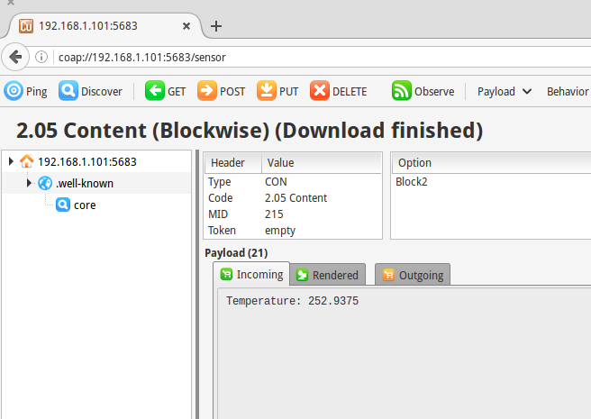

# coap-pi
Implementation of coap server with Sensorian sheild on Raspberry Pi

### Setup

- Follow [these instructions](https://github.com/Tanganelli/CoAPthon#install-instructions) to install coap dependancices on Raspberry Pi.

- If you are using a factory image of raspbian for the pi and not the [Sensorian image](http://sensorian.io/downloads), you need to install the [firmware](https://github.com/sensorian/sensorian-firmware)

### Run

- SSH into the pi.

- Run the server on the pi.

```
python server.py
```

- Run firefox and navigate to the coap server address `coap://{pi-ip-address}:5683/sensor`

- Run a GET command to get the temperature payload from the sensorian sheild.


